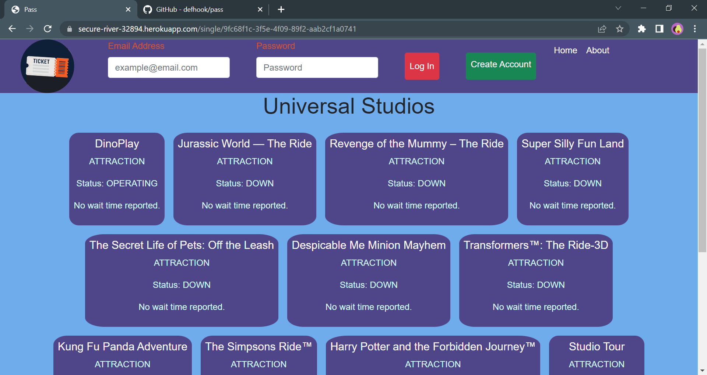

# Pass
## Description
  
- Reason behind the project: To provide theme park visitors an easy way to track wait times and availability of their favorite attractions
- Purpose or Problem Solved: It provides a quick realtime resume of over 110 theme park attractions, shows, restaurants, and more
- Important information learned: We learned how to collaborate on a MERN Stack project
  
## Table of Contents (Optional)
  
- [Installation](#installation)
- [Usage](#usage)
- [Credits](#credits)
- [License](#license)
- [Tests](#tests)
- [Questions](#questions)
  
## Installation

Follow the link below
https://secure-river-32894.herokuapp.com/

## Usage
  
Create a user, navigate to home and use our search engine to save your favorites!

Screenshot attatched
  

  
## Credits
  
Collaborators: Ruby Sierra, Marcos Palacios, Alvin Badillo, Francisco Rivera 
  
## License
  
Unlicensed

## Tests
  
No tests at this time
  
## Questions
  
All questions and communications can be directed to:
Github: Repository at github.com/defhook/pass 
